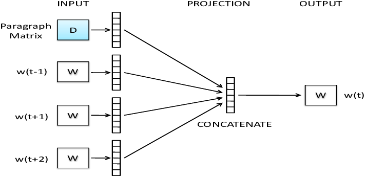
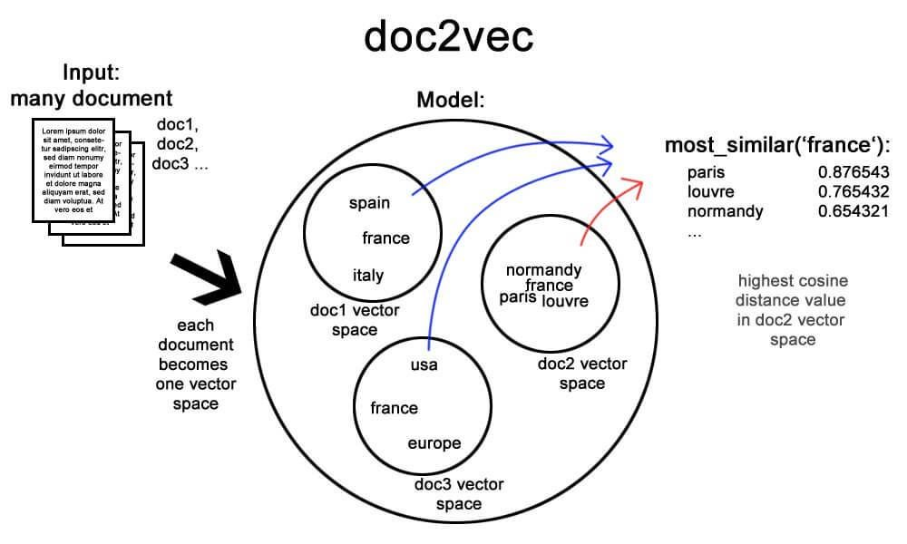

# Descripción de la problematica.

Se tiene un conjunto de noticias sobre el cual se desea realizar un agrupamiento de estas según su similitud, de tal manera que, dada una noticia, se listen las n noticias más similares.

# 1. Análisis
## 1.1 Descripción

La solución propuesta consiste en, mediante el algoritmo Doc2Vec, hacer la representación vectorial de los documentos, y después, se halla la similitud entre estos con la función de similitud "Distancia Coseno". A continuación se explicarán Doc2Vec y Distancia coseno:

### 1.1.1 Doc2Vec:

Dado varios documentos, se construye un vector de características que describen los documentos. Este algoritmo tiene en cuenta el contexto que rodea a las palabras, haciendo innecesario que se remuevan las stopwords, ya que se puede perder información importante. La arquitectura del modelo es la siguiente:

### 1.1.2 Distancia Coseno:

La Distancia Coseno halla el coseno del ángulo que hay entre dos vectores. Entre menos parecidos sean dos vectores, su ángulo se hará cercano a 90°.

##

A continuación se ilustra el funcionamiento completo del Doc2Vec junto a la Distancia Coseno

## 1.2 Definición de tecnología de desarrollo para el algoritmo:

* Lenguaje de Programación: Python - PySpark
* Técnica Aplicada: Doc2Vec y Distancia Coseno. 
