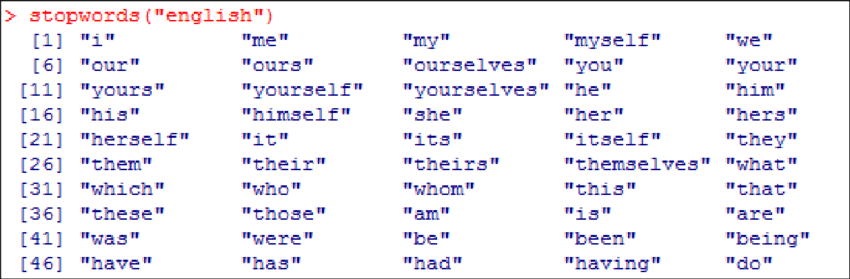
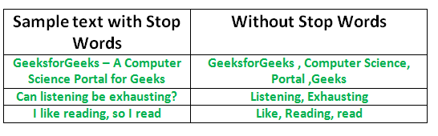
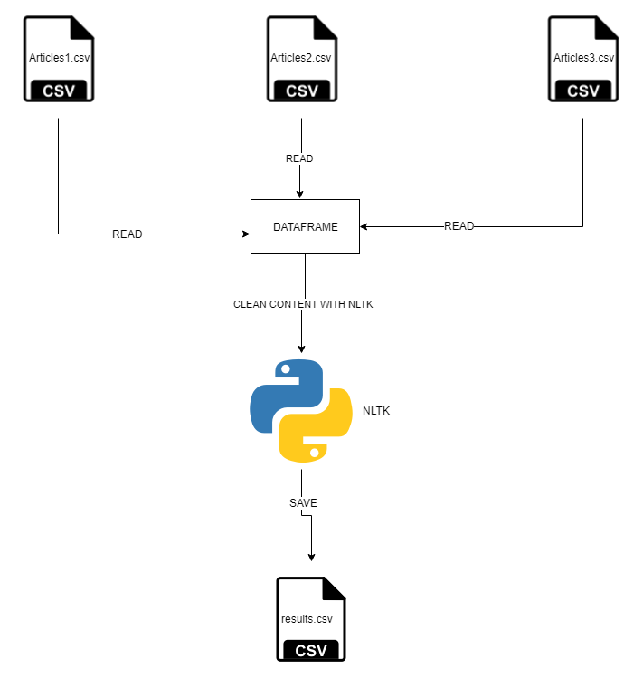

# Descripción de la Problematica
Se tiene un conjunto de noticias en texto libre, con ciertas palabras que no aportan nada al análisis posterior que se hace, sobre el que se debe hacer lo siguiente:
Por cada noticia en el apartado del header se deben remover stopwords que no dan significancia para este proyecto.
1. Remover caracteres especiales (. , % ( ) ‘ “ ….
2. Remover stop-words
3. Remover palabras de longitud 1

# 1. Análisis
## 1.1 Descripción
Para este proceso se usa la libreria NLTK de python que tiene consigo la funcionalidad de la remoción de stopwords, para este caso en particular
stopwords en ingles.

Para esto se hace una lectura de los archivos y se hace una limpieza de las anteriores stopwords en la parte del content

Luego de que el content queda limpio se da fin al proceso de limpieza de los datos y se almacenan en un .csv para los siguientes procesos del proyecto

Para mayor entendimiento ver el siguiente grafico en el cual se explica el proceso que pasa la data para llegar al punto final que es un csv limpio para el trabajo en el indice invertido.

